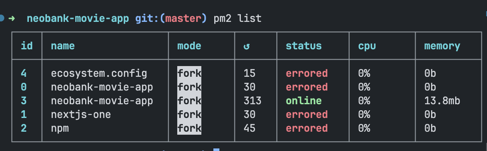

This is a [Next.js](https://nextjs.org/) project bootstrapped with [`create-next-app`](https://github.com/vercel/next.js/tree/canary/packages/create-next-app).

## Getting Started

Before run the development server, install all packages by running this command

```bash
npm install / npm i
```
Then install pm2 globally/locally, because this project have pm2 script and could be run from pm2 command
```bash
npm install -g pm2
```
By installing pm2, you could run this project without ```npm run dev```
```bash
pm2 start "npm run dev" --name {project_name}
```
Then, this project would run on default NextJS port (3000)

Then, run ```pm2 list``` command to show if the project is online



## Deploying with PM2
I have included ```ecosystem.config.ts``` script to run deployment, before deploying, make sure to build the project by running
```bash
npm run build
```
Then, go to ```ecosystem.config.ts``` file, and change ```cwd``` line to your local project directory
```bash
cwd: "your_project_directory",
```
Hit this command
```bash
pm2 start ecosystem.config.ts
```
Then it should be run the project.

### Note
Some features like
- Language translation
- SSR and SEO optimization

Are not implemented yet, I am sorry regarding this inconvenience, I will try to find the efficient way to implement this feature in the near future.